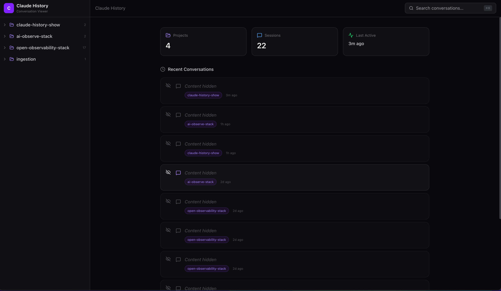
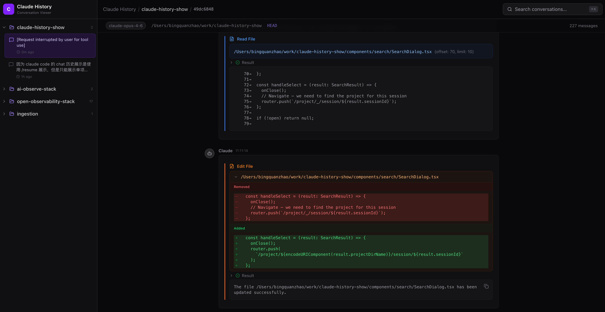
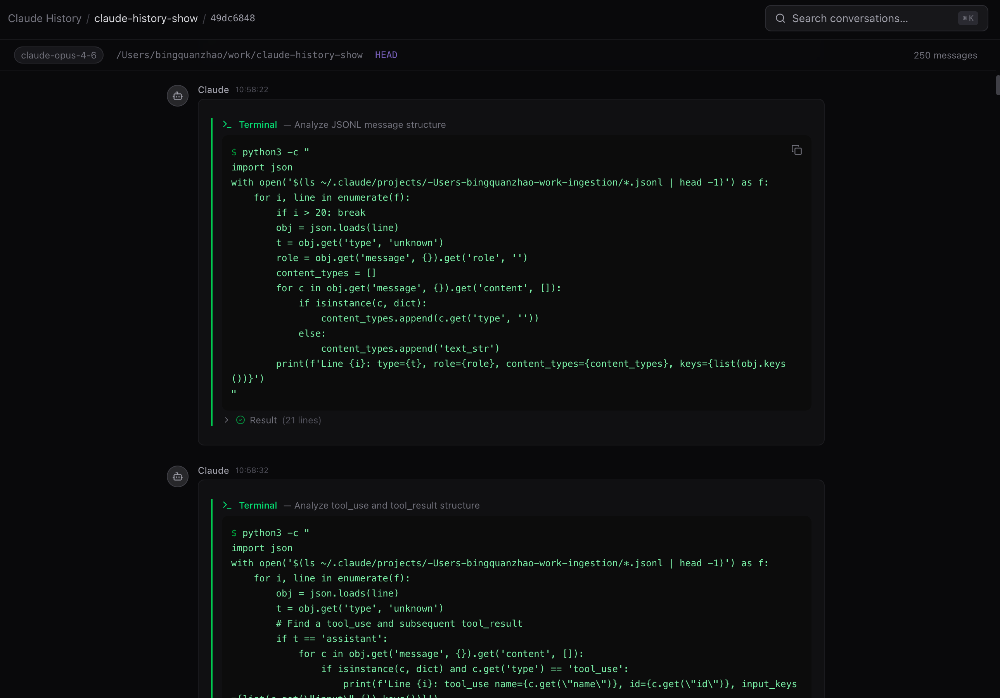
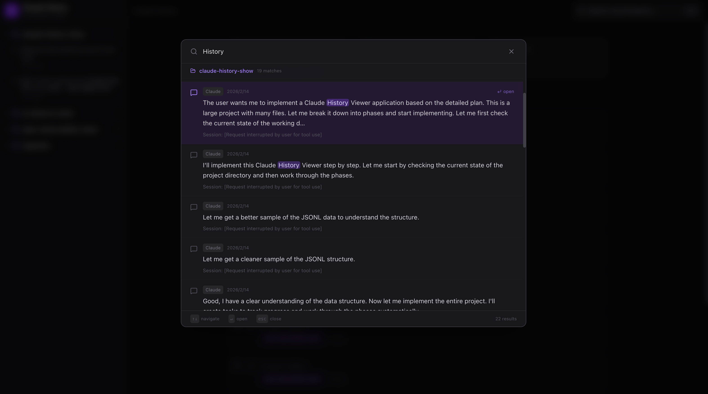

# Claude History Viewer

[English](./README.md) | 中文

浏览、搜索和回顾你所有 [Claude Code](https://docs.anthropic.com/en/docs/claude-code) 的对话历史 —— 跨项目、暗色主题、一目了然。

## 为什么需要这个工具

如果你每天都在用 Claude Code，大概率遇到过这些痛点：

**1. `/resume` 只能看当前项目**
Claude Code 内置的 `/resume` 命令只显示当前项目的对话历史。如果你同时在 5 个、10 个甚至 20 个项目中使用 Claude Code，根本没办法在一个地方看到所有对话，也很难记清某次对话发生在哪个项目里。

**2. 原始 JSONL 文件根本没法读**
Claude Code 将对话数据存储在 `~/.claude/projects/` 下的 JSONL 文件中。这些文件包含流式消息片段、工具调用/结果对、进度事件和二进制图片数据 —— 全部交织在一起。用文本编辑器打开基本等于天书。

**3. 无法跨对话搜索**
想找到 Claude 帮你配置 Nginx 的那次对话？或者调试某个竞态条件的那个 session？没有内置搜索。你只能用 `grep` 在原始 JSONL 文件里翻找，再从碎片化的 JSON 中拼凑上下文。

**4. 工具调用完全不可见**
当 Claude 读文件、执行命令、编辑代码或启动子代理时，这些操作记录在 JSONL 中，但没有合适的渲染方式根本看不到。你无法直观了解 Claude 在一次会话中到底 *做了什么*。

Claude History Viewer 解析原始 JSONL 数据，将其渲染为清晰、可导航的对话界面，一次性解决以上所有问题。

## 截图预览

### 首页 — 跨项目总览与最近对话
侧边栏列出所有项目及会话数量，主区域展示汇总统计和跨项目的最近对话列表。敏感对话可通过眼睛图标一键隐藏，方便截图分享。



### 对话视图 — 文件读取与编辑 Diff 渲染
每种工具都有专属可视化组件。图中展示了 **Read File** 工具（蓝色边框）的文件内容显示，以及 **Edit File** 工具（橙色边框）的 Diff 对比视图，红色表示删除、绿色表示新增。



### 对话视图 — 终端命令渲染
**Bash** 工具（绿色边框）以深色终端风格渲染命令，输出带有语法高亮，长输出可折叠收起。



### 全局搜索 (`Cmd+K`)
跨所有项目的全文搜索，结果按项目分组并带有粘性标题，关键词以紫色高亮，每条结果附带会话上下文。支持键盘快捷键导航。



## 功能特性

### 跨项目导航
侧边栏展示 `~/.claude/projects/` 下的所有项目，按最近活跃时间排序。每个项目可展开查看对话列表，显示首条用户消息作为预览。点击任意项目的会话时，对应项目文件夹自动展开联动。空会话（无用户消息）会被自动过滤。

### 对话回放
每个会话被渲染为完整的对话线程。解析器处理 Claude Code 的流式格式 —— 合并共享同一 `message.id` 的碎片化助手消息，并将每个 `tool_use` 块与下一条消息中对应的 `tool_result` 进行匹配。

### 专用工具渲染器
Claude 使用的每种工具都有专属的可视化组件：

- **终端 (Bash)** — 深色终端风格，带 `$` 前缀、命令说明和可折叠输出
- **文件读取 (Read)** — 显示文件路径和行范围
- **文件写入 (Write)** — 可折叠的文件内容，显示行数统计
- **文件编辑 (Edit)** — Diff 对比视图，红色（删除）和绿色（新增）高亮
- **搜索 (Grep/Glob)** — 显示搜索模式、路径范围和匹配结果
- **子代理 (Task)** — 显示委托任务描述和代理响应
- **通用回退** — 其他工具以可折叠 JSON 参数方式展示

每种工具类型都有独特的彩色左边框（Bash=绿色、Read=蓝色、Write=琥珀色、Edit=橙色、Search=青色、Task=紫色），让你一眼就能扫出 Claude 做了哪些操作。

### 思考过程
Claude 的扩展思考块以可折叠区域渲染 —— 默认折叠并显示简短预览，展开后可查看完整推理链。既保持对话可读性，又保留了对 Claude 思考过程的访问。

### Markdown 渲染
助手文本响应以完整的 GitHub Flavored Markdown 格式渲染，支持标题、列表、表格、引用、行内代码和围栏代码块。

### 全局搜索 (`Cmd+K`)
在任何页面按 `Cmd+K`（或 `Ctrl+K`）打开搜索弹窗：

- **全文搜索** —— 跨所有项目的所有对话
- **关键词高亮** —— 匹配词以紫色高亮显示
- **键盘导航** —— `↑↓` 移动选择、`Enter` 打开、`Esc` 关闭
- **按项目分组** —— 粘性项目标题方便快速浏览
- **会话上下文** —— 每条结果显示所属会话的首条用户消息，帮助你定位来源

### 一键复制
每条用户消息、助手回复和代码块都有悬停显示的复制按钮，一键复制到剪贴板。

### 会话元信息
每个对话视图顶部展示元信息：使用的 Claude 模型（如 `claude-opus-4-6`）、工作目录、Git 分支和总消息数。

## 快速开始

```bash
git clone https://github.com/bingquanzhao/claude-history-show.git
cd claude-history-show

npm install
npm run dev
```

浏览器打开 [http://localhost:3000](http://localhost:3000) 即可使用。

### 前置条件

- **Node.js** 18+
- 已安装 **Claude Code** 且在 `~/.claude/projects/` 下有对话历史

### 生产构建

```bash
npm run build
npm start
```

## 工作原理

Claude Code 将对话数据写入 `~/.claude/projects/[PROJECT_PATH]/[SESSION_UUID].jsonl`，每行是一个带 `type` 字段的 JSON 对象：

| 类型 | 说明 |
|------|------|
| `user` | 用户消息（文本、图片、工具结果） |
| `assistant` | Claude 的响应（文本、思考、工具调用） |
| `progress` | 工具执行的流式进度事件 |
| `file-history-snapshot` | 用于撤销功能的文件状态快照 |

解析管线流程：

1. **项目扫描器** (`lib/parser/project-scanner.ts`) — 遍历 `~/.claude/projects/` 发现所有项目目录及其 `.jsonl` 会话文件
2. **JSONL 读取器** (`lib/parser/jsonl-reader.ts`) — 逐行流式解析 JSONL 文件，保证内存效率
3. **会话解析器** (`lib/parser/session-parser.ts`) — 过滤出 user/assistant 消息，合并共享同一 `message.id` 的连续助手条目（Claude Code 将流式响应写为多行 JSONL），处理纯字符串、字符数组和结构化内容块三种格式
4. **对话构建器** (`lib/parser/conversation-builder.ts`) — 通过 `tool_use_id` 将助手消息中的 `tool_use` 块与后续用户消息中的 `tool_result` 块配对，生成每个工具调用都附带结果的完整对话结构

所有处理均在服务端通过 Next.js API Routes 完成。**数据不会离开你的电脑。**

## 技术栈

| 层级 | 选型 | 理由 |
|------|------|------|
| 框架 | Next.js 15 (App Router, Turbopack) | 通过 API Routes 实现服务端 JSONL 解析，HMR 快速 |
| 样式 | Tailwind CSS | 原子化 CSS，零运行时，暗色主题 |
| Markdown | react-markdown + remark-gfm | 支持 GFM 表格、任务列表、删除线 |
| 图标 | lucide-react | 简洁、统一的图标集 |
| 搜索 | 服务端全文搜索 | 无需外部服务，流式遍历文件 |

## 项目结构

```
app/
├── layout.tsx                              # 根布局（暗色主题）
├── page.tsx                                # 首页：项目统计 + 最近会话
├── globals.css                             # Tailwind + 自定义样式（暗色主题、diff、终端）
├── api/
│   ├── projects/route.ts                   # GET 获取所有项目和会话
│   ├── sessions/[sessionId]/route.ts       # GET 获取解析后的完整对话
│   └── search/route.ts                     # GET 全文搜索
└── project/[projectName]/
    └── session/[sessionId]/page.tsx        # 对话详情页

components/
├── layout/
│   ├── Sidebar.tsx                         # 项目树导航，点击自动展开联动
│   └── Header.tsx                          # 面包屑 + 搜索入口
├── conversation/
│   ├── ConversationView.tsx                # 对话主容器，含元信息栏
│   ├── UserMessage.tsx                     # 用户消息（紫色主题）
│   ├── AssistantMessage.tsx                # 助手消息分发器
│   ├── ThinkingBlock.tsx                   # 可折叠思考过程
│   ├── TextBlock.tsx                       # Markdown 渲染
│   ├── ToolUseBlock.tsx                    # 工具调用分发（路由到 tools/*）
│   ├── ToolResultBlock.tsx                 # 可折叠工具输出
│   └── CopyButton.tsx                     # 剪贴板复制
├── tools/
│   ├── BashTool.tsx                        # 终端风格命令展示
│   ├── ReadTool.tsx                        # 文件读取展示
│   ├── WriteTool.tsx                       # 文件写入（可折叠内容）
│   ├── EditTool.tsx                        # Diff 视图（红/绿高亮）
│   ├── SearchTool.tsx                      # Grep/Glob 搜索展示
│   └── GenericTool.tsx                     # 未知工具回退
└── search/
    └── SearchDialog.tsx                    # Cmd+K 搜索弹窗（键盘导航 + 分组）

lib/
├── types.ts                                # TypeScript 类型定义
├── constants.ts                            # ~/.claude 路径、工具颜色/标签映射
├── utils.ts                                # cn()、formatProjectName()、truncate() 等
└── parser/
    ├── jsonl-reader.ts                     # 流式 JSONL 文件读取器
    ├── session-parser.ts                   # 合并流式消息、解析内容块
    ├── conversation-builder.ts             # tool_use ↔ tool_result 匹配，构建对话
    └── project-scanner.ts                  # 从文件系统发现项目和会话
```

## 隐私

此工具完全在你的本地机器上运行。它从主目录（`~/.claude/projects/`）读取 Claude Code 的对话文件，通过本地 Next.js 服务器提供服务。不会向任何外部服务发送数据。

## 许可证

MIT
